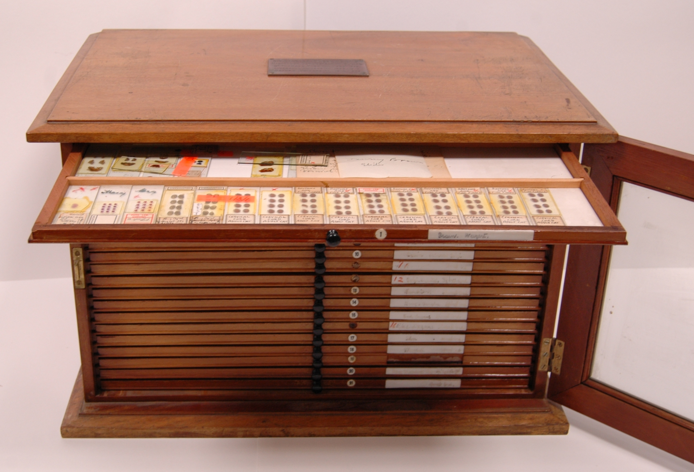

Using our digital pathology platform we were able to digitise the invaluable microscope slides from these rare collections. The goal is to preserve them in case of future damage and allow online access for teaching purposes. I wrote a code that allowed the digital scanner to be compatible with the problematic slides within these collections and then applied my expertise to successfully scan a large proportion of them.
  
 
<b>About the collections:</b>
 
The University of Oxford holds several historically important slides, including collections from Sir Charles Sherrington and Sir Wilfrid Le Gros Clark. The Sherrington collection contains examples of a lifetime of work understanding the CNS, including slides related to original breakthroughs such as cortical localization in the brain. The Le Gros Clark collection holds brain sections which may be linked to his topological mapping of the main sensory areas of the cerebral cortex and the different nuclei of the thalamus. There is also a superb collection of clinical neurological cases with case histories.
 
These collections are being digitised and made available online as part of a project funded by the Wellcome Trust and FENS. The slides are being made available through [CSlide](https://cslide.medsci.ox.ac.uk/items/view/1005 "CSlide Collection"), a system for displaying high-resolution, zoomable, digital microscope slides and collecting information relating to these slides and their creators.

