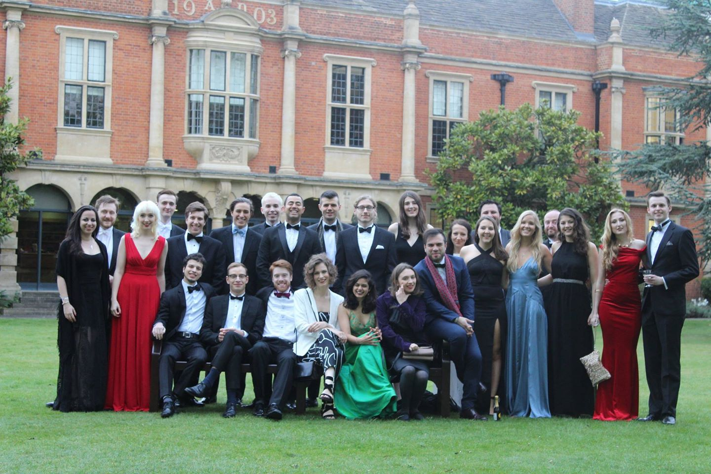

Founded in ~1248, the University of Oxford is a collegiate research university comprising of thirty-nine colleges. 

Somerville College - originally a woman only college and more recently the first non-denominational college - is known for its varied architecture and liberal atmosphere. Containing one of the largest libraries in the University of Oxford, 1/3 international students and over half the students coming from state high schools with net assets of ~£225 million (7th highest) and an annual endowment of £80.6 million; Somerville remains one of the highest-ranked in student satisfaction.  
 
<b>As Social Secretary I was responsible for:</b>  
 
i. Creating and Coordinating social events for the graduates throughout the academic year. (Averaging 3 per week)  
 
ii. Organising exchange events between the different University of Oxford Colleges - including drink receptions, formal dinners and wine and cheese events. 
 
iii. Organizing Fresher’s Week: Arranging induction and social induction events, welcoming new students and helping them adjust to life in Oxford and being the designated main point of contact during their first few weeks. 

