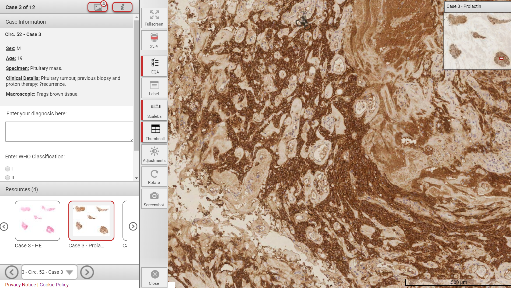

<b>Aims and Purpose of the Scheme</b>

The aim of the scheme is both educational and to identify poor performace in interpretive skills of participating neuropathologists. Neuropathologists compare their diagnostic skills with those of their peers. The feedback helps them to learn and improve. It also helps to maintain competence of consultants in Neuropathology and provides evidence of continuing professional development.  
 
https://www.bns.org.uk/eqa-scheme/    
 

<b>My Role:</b>  
 
I am the principal administrator for the BNS NEQAS UK Scheme. Microscope slides from predetermined cases are whole slide scanned, anonymised and uploaded to the appropriate PATHXL server. Using the PathXL platform I design the exam environment, add clinical histories, alternative staining slides, add questions and manage the permissions of each neuropathologist signed up to the scheme. Everyone’s exam outcome is anonymised, and individuals are given a score on how well they performed along with a breakdown on total number of correct diagnoses for each case.
 

